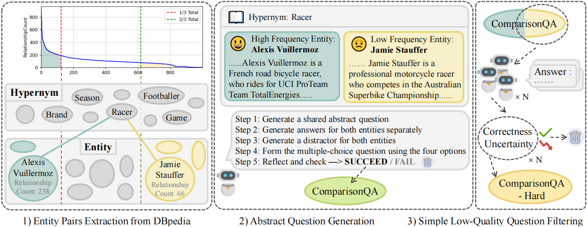

# ComparisonQA: Evaluating Factuality Robustness of LLMs Through Knowledge Frequency Control and Uncertainty

This repository is the official implementation of *ComparisonQA: Evaluating Factuality Robustness of LLMs Through Knowledge Frequency Control and Uncertainty*.

## Abstract
The rapid development of LLMs has sparked extensive research into their factual knowledge. 
Current works claim that LLMs fall short on questions requiring less frequent knowledge. 
However, their proof is incomplete since they only study the influence of entity frequency, which can not fully represent knowledge frequency. 
So we introduce **ComparisonQA** benchmark, containing **283K** abstract questions, 
each instantiated by a pair of high-frequency and low-frequency entities. 
It ensures a controllable comparison because the difference of knowledge frequency between such a pair is only related to entity frequency. 
In addition, to avoid possible semantic shortcuts, which is a severe problem of current LLMs study, we design a two-round method for knowledge robustness measurement utilizing both correctness and uncertainty. 
Experiments reveal that LLMs exhibit particularly low robustness regarding low-frequency knowledge, and GPT-4o is even the worst under this measurement. 
Besides, we introduce an automatic method to filter out questions with low-quality and shortcuts to form **dataset-Hard**. 
We find that uncertainty effectively identifies such questions while maintaining the data size.

## An Overview of Our Benchmark


## An Overview of Our Pipeline



## Requirements
You can install all requirements with the command:

```pip install -r requirements.txt```

## Datasets
The datasets used in the paper can be downloaded from the following links:
[ComparisonQA](https://1drv.ms/f/s!AtpcjEhwVs54kiGFT22K8li_yYu6?e=3O9kdC)

You can replace the data in the comparisonqa_benchmark folder with the downloaded data.

## Testing and Evaluation
For open source models:

To test the model, run the following command:

```python test.py --model_name meta-llama/Meta-Llama-3-8B-Instruct --mode zero ```

To compute the uncertainty, run the following command:

```python perplexity.py --model_name meta-llama/Meta-Llama-3-8B-Instruct --mode zero ```

For proprietary models, run the code in the LLM_api folder.

To evaluate the model, run the code in the evaluation folder. Files with names containing "batch" are for the Openai batch API.


